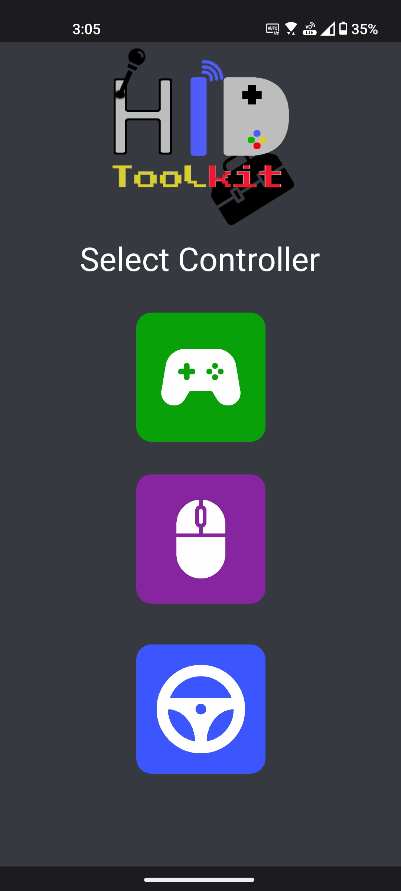

# HIDToolkit
Android app which allows for emulation of controllers such as a mouse on any computer
Currently allows emulation of:
- Mouse 
- Gamepad 
- Steering Wheel

Accomplished by making custom HID profiles of devices.

 

   
   

Steering wheel uses phone's motion sensors for input. Tested on racing simulators like Assetto corsa. Not practical for realistic driving but sufficient for arcade settings.

